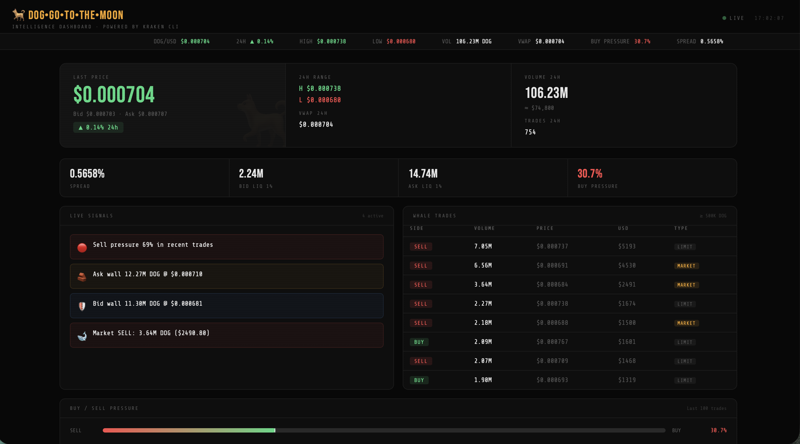

# 🐕 DOG•GO•TO•THE•MOON Intelligence Dashboard

> Real-time on-chain intelligence for the $DOG Army — powered by **Kraken CLI**



---

## What is this?

A live intelligence dashboard for the **DOG•GO•TO•THE•MOON** Runes token that tracks:

- 📈 Real-time price, volume, VWAP, 24h range
- 🐋 Whale trade detection (≥ 500K DOG)
- 🧱 Order book wall detection (≥ 5M DOG)
- ⚡ Buy/sell pressure analysis (last 100 trades)
- 🔴🟢 Automated market signals (bearish/bullish, VWAP divergence, market whale activity)
- 📊 Live order book depth with visual bars

All data is pulled directly from Kraken via the official **[Kraken CLI](https://www.kraken.com/kraken-cli)** — no third-party APIs, no middlemen.

---

## Stack

| Layer | Tech |
|-------|------|
| Data source | Kraken CLI (`kraken ticker`, `orderbook`, `trades`) |
| Backend | Node.js (zero dependencies, native `http` module) |
| Frontend | Vanilla HTML/CSS/JS — no build step |
| Refresh | Auto every 60s (server cache) + 30s client poll |

---

## Requirements

- **Node.js** v18+
- **Kraken CLI** installed

### Install Kraken CLI

```bash
curl --proto '=https' --tlsv1.2 -LsSf \
  https://github.com/krakenfx/kraken-cli/releases/latest/download/kraken-cli-installer.sh | sh

source $HOME/.cargo/env
kraken --version
```

---

## Quick Start

```bash
# 1. Clone the repo
git clone https://github.com/ra1nb93/dog-intel.git
cd dog-intel

# 2. Start the API server
node server.js

# 3. Open the dashboard
open index.html
```

The dashboard will connect to `http://localhost:3001/api/report` automatically.

---

## CLI Usage

Run the intelligence report directly in your terminal:

```bash
# Human-readable report
node dog-intel.js

# JSON output (for scripting / integrations)
node dog-intel.js --json

# Auto-refresh every 60 seconds
node dog-intel.js --watch
```

### Example terminal output

```
────────────────────────────────────────────────────────────
🐕  DOG•GO•TO•THE•MOON — Intelligence Report
23/05/2026, 16:47:18
────────────────────────────────────────────────────────────

PRICE
  Last     $0.000703  ▼ 0.57% 24h
  Bid/Ask  $0.000700 / $0.000703
  24h      H: $0.000738  L: $0.000680
  VWAP 24h $0.000704

VOLUME
  24h      106.19M DOG  ($74,777)
  Trades   754

ORDERBOOK
  Spread   0.4267%
  Bid liq  2.73M DOG within 1%
  Ask liq  1.94M DOG within 1%

  ASK WALLS
    $0.000710  12.91M DOG

  BID WALLS
    $0.000679  14.99M DOG
    $0.000680   8.68M DOG

WHALE ACTIVITY
  Buy pressure  30.3%
  Top trades:
    SELL  7.05M DOG  @ $0.000737  ($5193)
    SELL  6.56M DOG  @ $0.000691  ($4530)
    BUY   2.09M DOG  @ $0.000767  ($1601)

SIGNALS
  🔴  Sell pressure 70% in recent trades
  🧱  Ask wall 12.91M DOG @ $0.000710
  🛡️   Bid wall 14.99M DOG @ $0.000679
  🐋  Market SELL: 3.64M DOG ($2490.80)
  📉  Price -0.73% below 24h VWAP
```

---

## API Endpoints

With `server.js` running on port 3001:

| Endpoint | Description |
|----------|-------------|
| `GET /api/report` | Full intelligence report (JSON, cached 60s) |
| `GET /api/health` | Server health check |

---

## Project Structure

```
dog-intel/
├── README.md       ← you are here
├── package.json    ← { "type": "module" }
├── server.js       ← API server (Node built-ins only, no npm install)
├── dog-intel.js    ← CLI intelligence engine
└── index.html      ← dashboard (open directly in browser)
```

---

## Thresholds

| Signal | Threshold |
|--------|-----------|
| Whale trade | ≥ 500,000 DOG |
| Order wall | ≥ 5,000,000 DOG |
| Bullish pressure | Buy volume > 65% of last 100 trades |
| Bearish pressure | Sell volume > 65% of last 100 trades |
| VWAP divergence | Price ±0.5% from 24h VWAP |

---

## Built for the Kraken CLI Agent Zero Competition

This project was built as a submission for the **[Kraken CLI Agent Zero Promotion](https://support.kraken.com/articles/agent-zero-promotion)** — a $25,000 competition for the best builds using Kraken CLI.

The goal: give the **$DOG Army** a free, open-source intelligence tool that runs locally, pulls live data directly from Kraken, and requires zero API keys for public market data.

---

## Submission

🐦 [X post](https://x.com/Ra1nBlack/status/2058219061142589483)

---

## License

MIT — fork it, build on it, go to the moon. 🐕

---

*Built with ❤️ and Kraken CLI · Data refreshes every 60s · Not financial advice*
